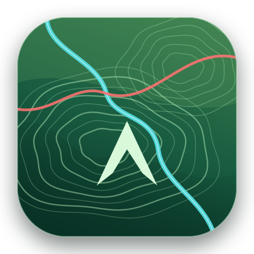
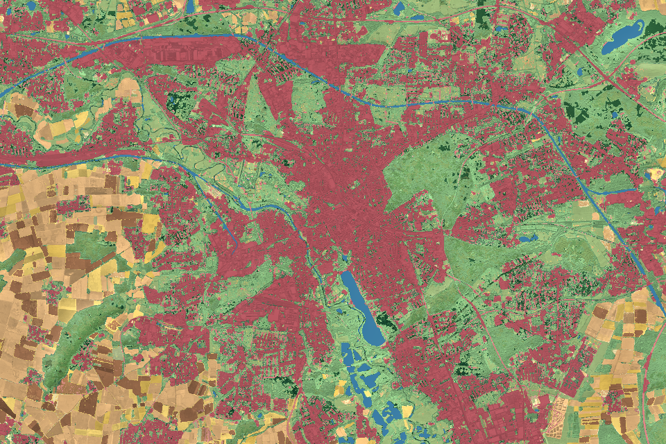
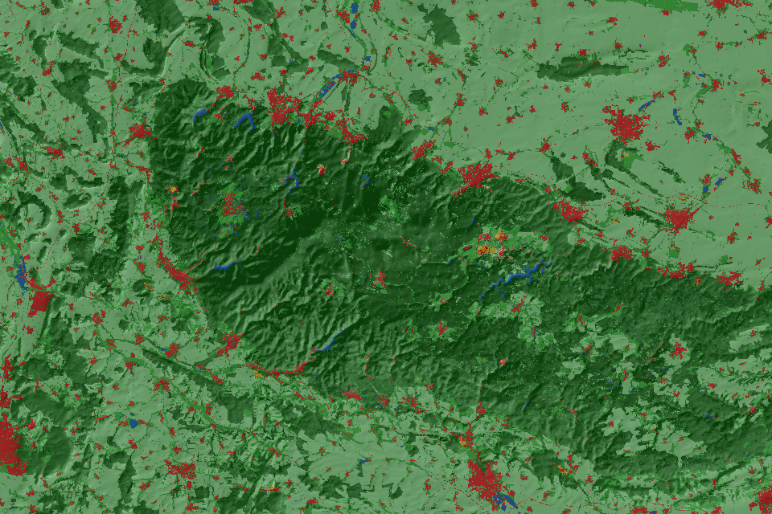
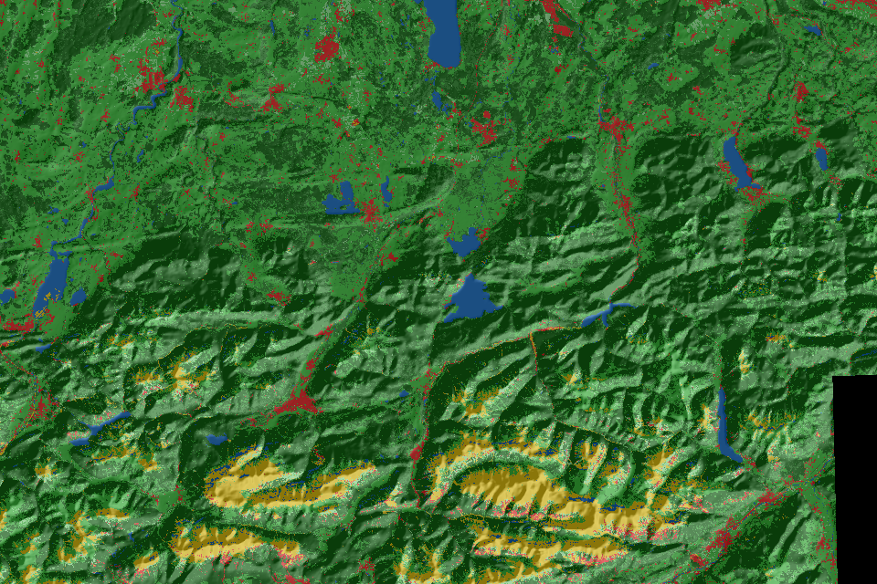
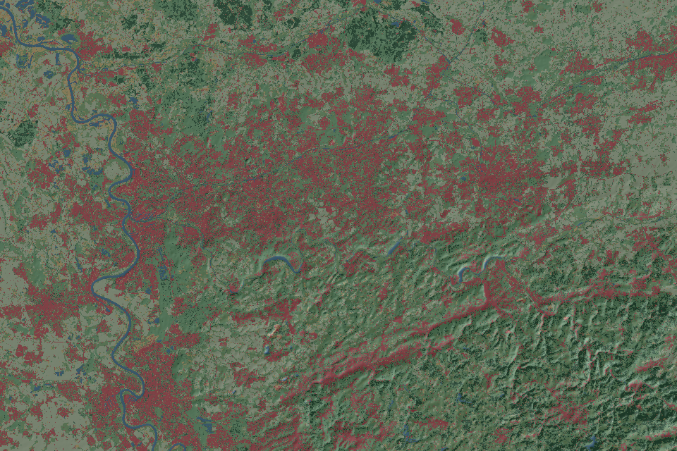
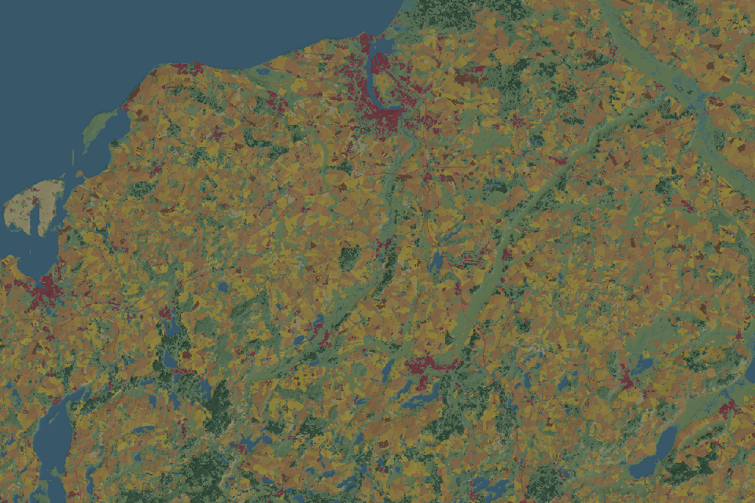

<p align="center">
  
</p>

<h1 align="center">TopoExplorer</h1>

<p align="center">
  <strong>Deutschland als interaktive 10-m-Landoberflächenkarte – nativ, lokal und mit Metal gerendert.</strong>
</p>

<p align="center">
  
  
  
  
</p>



<p align="center"><sub>Hannover: Landbedeckung, Sentinel-2-Feinstruktur und Relief in einer gemeinsamen Darstellung.</sub></p>

TopoExplorer verbindet hochauflösende Landbedeckung mit Gelände, Infrastruktur,
Bevölkerung und geowissenschaftlichen Fachkarten. Sichtbare Kacheln werden
bedarfsgerecht geladen und direkt auf der GPU aufgebaut. Die Quelldaten und
Analysen bleiben auf dem eigenen Mac.

## Auf einen Blick

| | |
|---|---|
| **10-m-Landoberfläche** | 40 durchsuchbare und frei färbbare Klassen für ganz Deutschland |
| **Metal-Relief** | Live steuerbare Stärke, Überhöhung und Kontrast ohne vorgerenderte Schummerung |
| **Fachkarten** | Substrat, Geologie, Reliefform und Grundwasser als eigenständige Kartenfamilie |
| **Lokale Analyse** | Flächen, Profile, Bevölkerung, Dichte, Höhenraum und Landschaftsmosaik auswerten |
| **Offenes Feldbuch** | Fundstellen vergleichen, kommentieren und verlustfrei als GeoJSON austauschen |
| **Kartografischer Export** | Karte bis 4× neu rendern, inklusive feinerer Kacheln, Maßstab und Stil-Datei |

## Kartenansichten

<table>
  <tr>
    <td width="50%">
      <br>
      <sub><b>Harz</b> · Waldarten, Landnutzung und ausgeprägtes Relief</sub>
    </td>
    <td width="50%">
      <br>
      <sub><b>Alpen</b> · Höhenstufen, Täler, Seen und Siedlungsachsen</sub>
    </td>
  </tr>
  <tr>
    <td width="50%">
      <br>
      <sub><b>Ruhrgebiet</b> · Verdichtungsraum und grüne Freiraumstruktur</sub>
    </td>
    <td width="50%">
      <br>
      <sub><b>Küste</b> · Marsch, Ackerflächen, Gewässer und Inseln</sub>
    </td>
  </tr>
</table>

## Schnellstart

> **Wichtig:** Das Repository enthält den Quellcode, aber keine fertige
> Deutschlandkarte. Der vollständige Datenaufbau erzeugt lokal etwa **9–10 GB**
> Kartendaten und benötigt zusätzlich das aktuelle Deutschland-PBF von
> OpenStreetMap. Für einen problemlosen Lauf sind mindestens **20 GB freier
> Speicher** sinnvoll.

Vorausgesetzt werden macOS 14 oder neuer, die Apple Command Line Tools,
Python 3 und eine Internetverbindung. `osmium-tool` wird benötigt; bei
vorhandenem Homebrew installiert das Vorbereitungsskript es automatisch.

### 1. Drei Pflichtquellen ablegen

| Datengrundlage | Wofür? | Erwarteter Pfad | Beschaffung |
|---|---|---|---|
| **DLR Land Cover DE 2015** | Deutschlandgrenze und Wald-Offenflächen | `Data/Raw/LandCover/Land_Cover_DE_2015.tif` | [DLR-Download, ZIP 244 MiB](https://download.geoservice.dlr.de/LCC_DE/files/Land_Cover_DE_2015_v1.zip) entpacken |
| **GMTED2010 Mean, 7,5″** | Relief und Höhenabfragen | `Data/Raw/Elevation/gmted2010_mean_7p5arcsec.tiff` | [USGS GMTED2010](https://www.usgs.gov/centers/eros/science/usgs-eros-archive-digital-elevation-global-multi-resolution-terrain-elevation), als GeoTIFF für Deutschland |
| **OpenStreetMap Deutschland** | Straßen, Bahn, Gewässer, Grenzen, Orte und Energie | `Data/Raw/OSM/germany-latest.osm.pbf` | [Geofabrik-PBF, derzeit etwa 4,5 GB](https://download.geofabrik.de/europe/germany-latest.osm.pbf) |

Ordner anlegen und die beiden direkt verfügbaren Dateien laden:

```sh
mkdir -p Data/Raw/LandCover Data/Raw/Elevation Data/Raw/OSM

curl -fL --continue-at - \
  -o Data/Raw/LandCover/Land_Cover_DE_2015_v1.zip \
  https://download.geoservice.dlr.de/LCC_DE/files/Land_Cover_DE_2015_v1.zip
unzip -o -j Data/Raw/LandCover/Land_Cover_DE_2015_v1.zip \
  -d Data/Raw/LandCover

curl -fL --continue-at - \
  -o Data/Raw/OSM/germany-latest.osm.pbf \
  https://download.geofabrik.de/europe/germany-latest.osm.pbf
```

Beim USGS-Export **Mean**, **7,5 arc-seconds**, **GeoTIFF** und einen
Deutschlandausschnitt wählen. Die Datei anschließend exakt
`gmted2010_mean_7p5arcsec.tiff` nennen. Andere DEMs funktionieren ebenfalls,
sofern Rasterio sie lesen kann; sie werden automatisch nach EPSG:3035
reprojiziert. Details und Datenanforderungen stehen unter
[Datengrundlagen einrichten](docs/Datenquellen.md).

### 2. Eingaben prüfen

```sh
./scripts/check_source_data.sh
```

Der Check unterscheidet Pflichtquellen, optionale Daten und Dateien, die später
automatisch geladen oder erzeugt werden.

### 3. Karte erzeugen und App bauen

```sh
./scripts/prepare_all.sh
./scripts/build_app.sh
```

Danach liegt die startbereite Anwendung hier:

```sh
open .build/app/TopoExplorer.app
```

`prepare_all.sh` richtet die lokale Python-Umgebung ein, installiert bei
vorhandenem Homebrew das benötigte `osmium-tool` und erzeugt die Karte
fortsetzbar. ESA WorldCover, EUCROPMAP, ForestPaths und BKG GN250 werden dabei
automatisch geladen. `railways.geojson` und `places.geojson` werden automatisch
aus dem OSM-PBF abgeleitet. Abgebrochene Läufe können mit demselben Befehl
fortgesetzt werden.

### Optionale Bevölkerungsanalyse

Für den ersten Kartenstart ist kein Bevölkerungsraster nötig. Wird ein
100-m-GeoTIFF in **EPSG:3035** unter
`Data/Raw/Population/Zensus_Bevoelkerung_100m-Gitter.tif` abgelegt, erzeugt
`prepare_all.sh` zusätzlich Flächen-, Dichte- und Umgebungsanalysen. Geeignete
Gitterdaten bietet das
[Statistische Bundesamt](https://www.destatis.de/DE/Themen/Gesellschaft-Umwelt/Bevoelkerung/Zensus2022/_inhalt.html).

Geowissenschaftliche BGR-Ebenen und die Sentinel-Oberflächentextur sind
ebenfalls optional und werden erst nach dem erfolgreichen Basisaufbau ergänzt.
Alternativ lässt sich der App-Code über `Package.swift` in Xcode öffnen.

## Was sich erkunden lässt

- **Landoberfläche:** Klassen suchen, einzeln oder gruppenweise umfärben,
  ausgrauen und als Naturatlas, Kulturarten-, Waldarten- oder Kontrastthema lesen.
- **Orientierung:** Straßen, Bahn, Flüsse, Grenzen, Orte, Landschaften und
  Energieinfrastruktur passend zur Zoomstufe einblenden.
- **Fundstellen:** Höhe, Hangneigung, Exposition, Landklasse, Quellenmaßstab und
  Umgebung direkt am Mauszeiger oder an gespeicherten Punkten untersuchen.
- **Analysen:** Rechtecke für Flächen- und Bevölkerungswerte sowie Linien für
  Höhenprofile und Landklassenabschnitte zeichnen.
- **Fachkarten:** Geologie, Substrat, Reliefform und Grundwasser exklusiv als
  Overlay oder Basiskarte verwenden.
- **Oberflächentextur:** neutrale Sentinel-2-Feinstruktur klassen- und
  zoomabhängig mit Landbedeckung, Relief und Fachkarten kombinieren.

## Bedienung in 30 Sekunden

| Aktion | Steuerung |
|---|---|
| Karte verschieben | Ziehen |
| Zoomen | Mausrad, Trackpad, Doppelklick oder `+` / `-` |
| Deutschland einpassen | `0` |
| Stöberpalette öffnen | `⌘K` |
| Datenatlas, Sammlung und Analysen | adaptive Kartenleiste |
| Stil austauschen | `.topostyle` importieren oder exportieren |

Eine vollständige Einführung steht in der
[Bedienungsanleitung](docs/Bedienungsanleitung.md).

## Projektstruktur

```text
Sources/TopoExplorer/   SwiftUI-, AppKit- und Metal-Anwendung
preprocess/             reproduzierbare Datenaufbereitung
scripts/                Build, Vorbereitung und Qualitätsprüfung
References/Generated/   Referenzrenderings für Landschaftstypen
Data/Raw/               lokale Quelldaten, nicht in Git
MapData/Germany/        erzeugte Kartenpyramide, nicht in Git
```

## Dokumentation

- [Bedienungsanleitung](docs/Bedienungsanleitung.md)
- [Datenquellen und Lizenzen](docs/Datenquellen.md)
- [Geowissenschaftliche Fachkarten](docs/Geowissenschaften.md)
- [Sentinel-Oberflächentextur](docs/Oberflaechentextur.md)
- [Datenordner und Sicherheitszugriff](docs/Datenordner-Lesezeichen.md)

## Qualität prüfen

```sh
./scripts/verify_image_quality.sh
```

Die Prüfung validiert Kacheldaten, vergleicht überlappende Relief-Kachelränder
bytegenau und rendert die Referenzlandschaften erneut.
